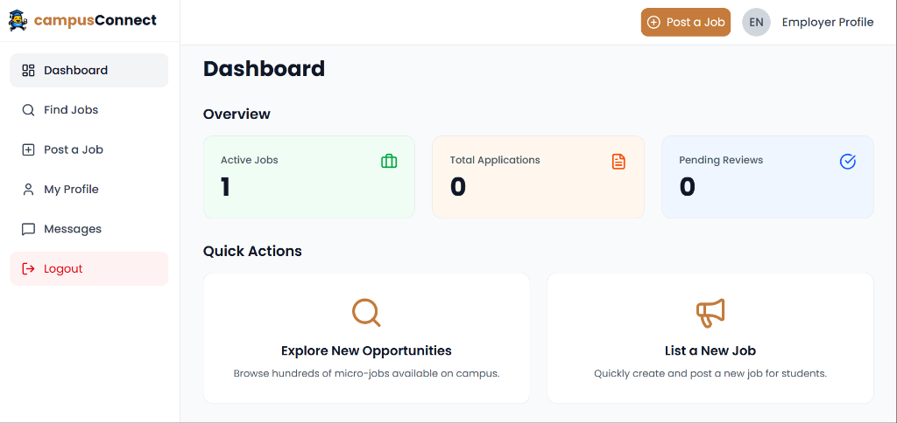

# 🎓 Campus Connect - Frontend

> A modern web application connecting students with on-campus job opportunities

**🌐 Live Demo: [https://campus-jobs.netlify.app/](https://campus-jobs.netlify.app/)**



[](https://nextjs.org/)
[](https://www.typescriptlang.org/)
[](https://tailwindcss.com/)
[](LICENSE)

---

## 📖 Overview

**Campus Connect** is a comprehensive platform designed to bridge the gap between students seeking part-time employment and nearby businesses and campus departments offering job opportunities. The application streamlines the job discovery, application, and management process within a university ecosystem.

### 🎯 What We're Building

A full-stack job board platform specifically tailored for campus environments, featuring:

- **For Students**: Browse, search, and apply for on-campus jobs with an intuitive interface
- **For Employers**: Post job opportunities, manage applications, and track hiring progress
- **For Admins**: Oversee platform operations, manage users, and moderate content

### ✨ Key Features

#### 🔍 Job Discovery
- Advanced filtering by category, location, duration, and pay rate
- Real-time search across job titles, descriptions, and departments
- Responsive grid layout with detailed job cards
- Visual indicators for application status

#### 👤 User Management
- Role-based access control (Student, Employer, Admin)
- Secure authentication with JWT tokens
- Comprehensive user profiles with skills and experience
- Profile picture uploads via Cloudinary integration

#### 💼 Job Management
- Create, edit, and delete job postings (Employers/Admins)
- Apply for jobs with one-click application (Students)
- Track application status and history
- Dashboard with personalized statistics

#### 🎨 User Experience
- Modern, clean UI with TailwindCSS
- Fully responsive design (mobile, tablet, desktop)
- Toast notifications for user feedback
- Loading states and error handling
- Smooth animations and transitions

---

## 🏗️ Architecture

### Tech Stack

#### Core Framework
- **Next.js 16.1.4** - React framework with SSR and routing
- **React 19.2.3** - UI component library
- **TypeScript 5.0** - Type-safe development

#### Styling & UI
- **TailwindCSS 4.0** - Utility-first CSS framework
- **Lucide React** - Modern icon library
- **Radix UI** - Accessible component primitives
- **Sonner** - Toast notification system

#### State Management
- **Redux Toolkit** - Global state management
- **React Context API** - Filter and auth state
- **Custom Hooks** - Reusable data fetching logic

#### API Integration
- **Axios** - HTTP client for API requests
- **Custom API Instance** - Centralized API configuration with interceptors

### Project Structure

```
campus-connect/
├── components/          # Reusable UI components
│   ├── dashboard/      # Dashboard-specific components
│   ├── jobs/           # Job-related components (JobCard, JobFilters)
│   ├── layout/         # Layout components (Header, Footer, Sidebar)
│   ├── profile/        # Profile components (EditProfileModal)
│   └── ui/             # Base UI components (Button, Input, Modal)
├── context/            # React Context providers
│   └── FilterContext.tsx
├── hooks/              # Custom React hooks
│   └── useFetch.ts
├── interfaces/         # TypeScript type definitions
│   └── index.ts
├── lib/                # Utility libraries
│   └── helpers.ts
├── pages/              # Next.js pages (file-based routing)
│   ├── _app.tsx       # App wrapper
│   ├── index.tsx      # Landing page
│   ├── dashboard.tsx  # User dashboard
│   ├── find-jobs.tsx  # Job listing page
│   ├── post-job.tsx   # Job creation page
│   ├── profile.tsx    # User profile page
│   └── jobs/
│       └── [id].tsx   # Job details page
├── public/             # Static assets
├── styles/             # Global styles
├── utils/              # Utility functions
│   ├── api.ts         # Axios instance configuration
│   └── auth.ts        # Authentication helpers
└── netlify.toml       # Netlify deployment config
```

---

## 🚀 Getting Started

### Prerequisites

- **Node.js** 20.x or higher
- **npm** 10.x or higher (or yarn/pnpm)
- **Backend API** running (see [backend setup](../campus-connect-backend/README.md))

### Installation

1. **Clone the repository:**
   ```bash
   git clone https://github.com/your-username/alx-project-nexus.git
   cd campus-connect
   git clone https://github.com/yourusername/alx-project-nexus.git
   cd alx-project-nexus/campus-connect
   ```

2. **Install dependencies:**
   ```bash
   npm install
   ```

3. **Configure Environment Variables:**
   Create a `.env.local` file in the `campus-connect` root:
   ```env
   NEXT_PUBLIC_API_URL=http://localhost:5000/api
   ```

4. **Launch Development Server:**
3. **Set up environment variables**
   
   Create a `.env.local` file in the root directory:
   ```env
   NEXT_PUBLIC_API_URL=http://localhost:5000/api
   ```

4. **Run the development server**
   ```bash
   npm run dev
   ```
   *Visit `http://localhost:3000` to see the application.*

---

## 🚢 Deployment

The frontend is optimized for deployment on **Netlify** or **Vercel**.

1. **Build the production bundle:**
   ```bash
   npm run build
   ```
2. **Dynamic Routes:** Ensure the deployment platform is configured to handle Next.js routing (already handled via `netlify.toml`).
   ```

5. **Open your browser**
   
   Navigate to [http://localhost:3000](http://localhost:3000)

### Build for Production

```bash
# Create optimized production build
npm run build

# Start production server
npm start
```

---

## 🎨 Features in Detail

### Authentication & Authorization

- **JWT-based authentication** with secure token storage
- **Role-based access control** with three user types:
  - **Students**: Can browse and apply for jobs
  - **Employers**: Can post and manage job listings
  - **Admins**: Full platform access and moderation capabilities
- **Protected routes** with automatic redirects
- **Persistent sessions** with local storage

### Job Discovery & Filtering

```typescript
// Advanced filtering system
interface JobFilters {
  category: string[];
  location: string[];
  duration: string[];
  time: string[];
  minPay: number;
  maxPay: number;
  search: string;
}
```

- **Multi-select filters** for categories, locations, and time preferences
- **Pay range slider** for salary filtering
- **Real-time search** with debouncing
- **Filter persistence** across page navigation
- **Clear all filters** functionality

### User Dashboard

Personalized dashboard showing:
- **Active jobs** count
- **Applied jobs** tracking (Students)
- **Posted jobs** management (Employers)
- **Quick actions** for common tasks
- **Recent activity** overview

### Profile Management

- **Editable profile** with modal interface
- **Profile picture upload** to Cloudinary
- **Skills management** with tag system
- **Contact information** (email, LinkedIn, website)
- **Department and student ID** tracking

---

## 🔌 API Integration

### API Configuration

```typescript
// utils/api.ts
import axios from 'axios';

const api = axios.create({
  baseURL: process.env.NEXT_PUBLIC_API_URL,
  headers: {
    'Content-Type': 'application/json',
  },
  withCredentials: true,
});

// Request interceptor for auth tokens
api.interceptors.request.use((config) => {
  const token = getAuthToken();
  if (token) {
    config.headers.Authorization = `Bearer ${token}`;
  }
  return config;
});
```

### Custom Hooks

```typescript
// hooks/useFetch.ts
export const useFetch = <T>(url: string, params?: any) => {
  const [data, setData] = useState<T | null>(null);
  const [loading, setLoading] = useState(true);
  const [error, setError] = useState<string | null>(null);

  // Fetch logic with error handling
  // Returns: { data, loading, error, refetch }
};
```

---

## 🎯 Key Components

### JobCard Component

Displays job information with:
- Job image with gradient overlay
- Category and application status badges
- Department, location, and pay information
- Duration and time preferences
- Delete functionality (Employers/Admins)
- Click-to-view details

### FilterContext

Global state management for job filtering:
- Manages all filter states
- Provides filter update functions
- Handles job data fetching
- Exposes filtered jobs to components

### DashboardLayout

Consistent layout wrapper with:
- Responsive sidebar navigation
- Header with user info
- Main content area
- Mobile-friendly menu

---

## 🔐 Security Features

- **JWT token authentication** with secure storage
- **Protected API routes** with authorization checks
- **Input validation** on all forms
- **XSS protection** with sanitized inputs
- **CORS configuration** for API security
- **Rate limiting** on API endpoints (backend)
- **Secure password handling** (backend)

---

## 📱 Responsive Design

The application is fully responsive with breakpoints for:
- **Mobile**: < 640px
- **Tablet**: 640px - 1024px
- **Desktop**: > 1024px

Key responsive features:
- Collapsible sidebar on mobile
- Grid layout adjustments
- Touch-friendly UI elements
- Optimized images for all screen sizes

---

## 🧪 Development Workflow

### Code Quality

- **TypeScript** for type safety
- **ESLint** for code linting
- **Prettier** for code formatting (recommended)
- **Component-based architecture** for reusability

### Best Practices

1. **Component Organization**
   - Keep components small and focused
   - Use TypeScript interfaces for props
   - Implement proper error boundaries

2. **State Management**
   - Use local state when possible
   - Context for shared UI state
   - Redux for complex global state

3. **Performance**
   - Lazy load components where appropriate
   - Optimize images with Next/Image
   - Implement proper memoization

4. **Accessibility**
   - Semantic HTML elements
   - ARIA labels where needed
   - Keyboard navigation support

---

## 🚀 Deployment

### Netlify Deployment

The application is configured for seamless Netlify deployment:

1. **Connect your repository** to Netlify
2. **Configure build settings**:
   - Build command: `npm run build`
   - Publish directory: `.next`
   - Base directory: `campus-connect`
3. **Set environment variables** in Netlify dashboard
4. **Deploy** automatically on push to main branch

See [DEPLOYMENT_GUIDE.md](../DEPLOYMENT_GUIDE.md) for detailed instructions.

---

## 🤝 Contributing

This project is part of the ALX Software Engineering Program. Contributions, issues, and feature requests are welcome!

### Development Setup

1. Fork the repository
2. Create a feature branch (`git checkout -b feature/AmazingFeature`)
3. Commit your changes (`git commit -m 'Add some AmazingFeature'`)
4. Push to the branch (`git push origin feature/AmazingFeature`)
5. Open a Pull Request

---

## 📝 Environment Variables

| Variable | Description | Required | Default |
|----------|-------------|----------|---------|
| `NEXT_PUBLIC_API_URL` | Backend API base URL | Yes | `http://localhost:5000/api` |

---

## 🐛 Known Issues & Roadmap

### Current Limitations
- Job application tracking is basic (no status updates)
- No real-time notifications
- Limited analytics for employers

### Planned Features
- [ ] Real-time chat between students and employers
- [ ] Advanced analytics dashboard
- [ ] Email notifications for applications
- [ ] Job recommendation system
- [ ] Calendar integration for interviews
- [ ] Mobile app (React Native)

---

## 📚 Documentation

- [API Integration Guide](./API_INSTANCE.md)
- [Cloudinary Setup](./CLOUDINARY_SETUP.md)
- [Role-Based Access Control](./ROLE_BASED_ACCESS_CONTROL.md)
- [Profile Integration](./PROFILE_INTEGRATION.md)
- [Deployment Guide](../DEPLOYMENT_GUIDE.md)

---

## 🙏 Acknowledgments

- **ALX Africa** - Software Engineering Program
- **Next.js Team** - Amazing framework and documentation
- **TailwindCSS** - Utility-first CSS framework
- **Vercel** - Hosting and deployment platform

---

## 📝 License

This project is part of the **ALX Software Engineering Program**. All rights reserved.
This project is licensed under the MIT License - see the [LICENSE](LICENSE) file for details.

---

## 👥 Contact

**Babatunde Omojuwa**  
- **GitHub:** [@juskins](http://www.github.com/juskins)
- **LinkedIn:** [Babatunde Omojuwa](http://www.linkedin.com/in/babatunde-omojuwa)
- **Email:** [omojuwababatunde1@gmail.com](mailto:omojuwababatunde1@gmail.com)
## 👨‍💻 Author

**Babatunde Omojuwa**

- GitHub: [@juskins](https://github.com/juskins)
- LinkedIn: [Babatunde Omojuwa](https://linkedin.com/in/babatunde-omojuwa)
- Email: omojuwababatunde1@gmail.com

---

## 🔗 Related Projects

- [Campus Connect Backend](../campus-connect-backend/README.md) - Node.js/Express API
- [Campus Connect Mobile](../campus-connect-mobile/README.md) - React Native app (coming soon)

---

<div align="center">

**Built with ❤️ for campus communities**

[Report Bug](https://github.com/juskins/alx-project-nexus/issues) · [Request Feature](https://github.com/juskins/alx-project-nexus/issues)

</div>
